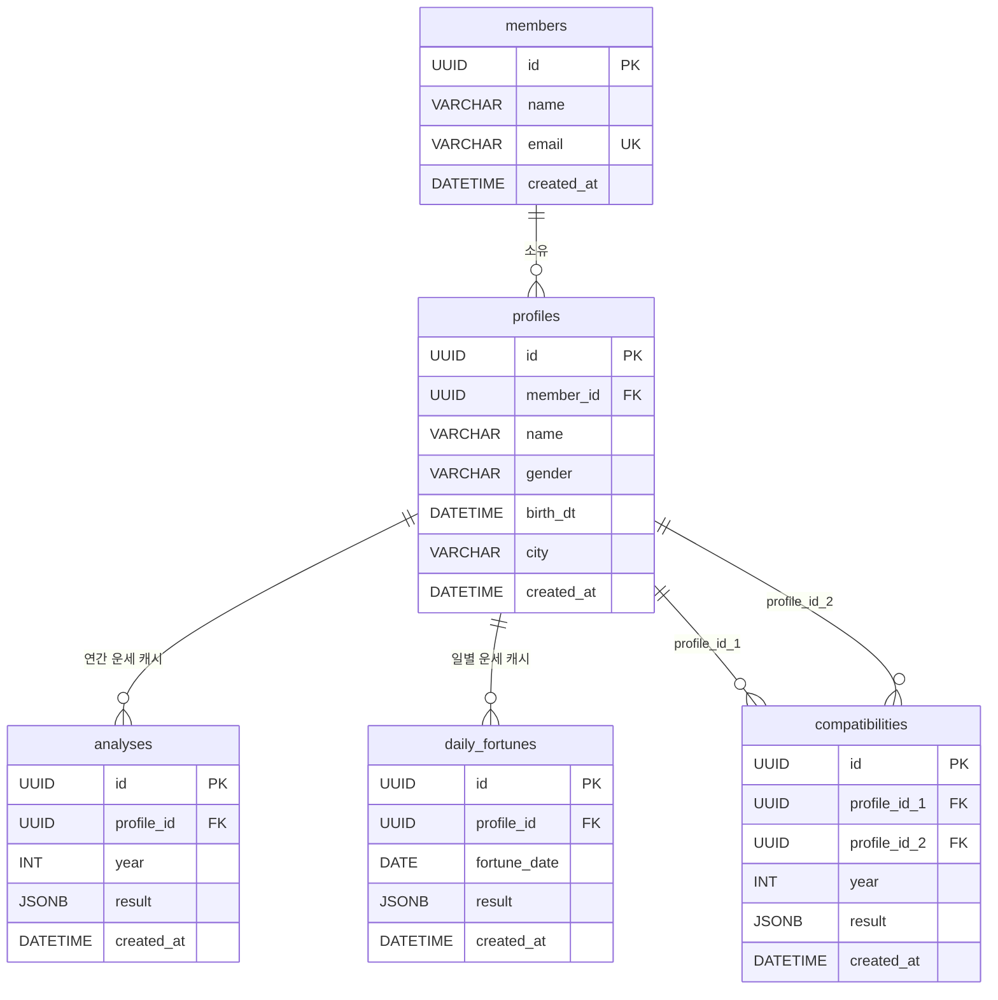

# BaZi 프로젝트 가이드

## 프로젝트 개요

사주팔자(四柱八字) 계산 및 오행 기반 종합 분석 웹 서비스.

- **백엔드**: Python 3.13 + FastAPI + sajupy
- **프론트엔드**: Next.js 16 + TypeScript + Tailwind CSS
- **아키텍처**: Hexagonal Architecture (Port & Adapter)
- **패키지 관리**: uv (Python), npm (Node)

## 실행

```bash
# DB (PostgreSQL 17 — Colima 또는 OrbStack 필요)
docker compose -f docker/docker-compose.yml up -d

# Alembic 마이그레이션
uv run alembic upgrade head

# 백엔드
uv run uvicorn kkachi.fastapi:app --reload --port 8000

# 프론트엔드
cd frontend && npm run dev

# 테스트
uv run pytest
uv run pytest -v
```

## 코드 구조

```
BaZi/
├── alembic/                 # DB 마이그레이션 (루트에 위치 — alembic.ini와 같은 레벨)
├── alembic.ini
├── docker/
│   └── docker-compose.yml   # 로컬 개발용 PostgreSQL 17
├── src/bazi/
├── fastapi.py               # FastAPI 앱 + CORS + 라우터 등록
├── container.py             # DI Container (dependency-injector Singleton)
├── domain/
│   ├── ganji.py             # Oheng, Stem, Branch, Sipsin, SibiUnseong enum
│   ├── natal.py             # Saju, NatalInfo, PostnatalInfo, DaeunPeriod dataclass
│   ├── user.py              # User dataclass, Gender enum
│   ├── interpretation.py    # NatalResult + PostnatalResult + Interpretation dataclass
│   ├── member.py            # Member dataclass
│   ├── profile.py           # Profile + Analysis dataclass
│   ├── compatibility.py     # CompatibilityResult + Compatibility dataclass
│   └── daily_fortune.py     # DailyFortune + DailyFortuneCache dataclass
├── application/
│   ├── saju_service.py           # SajuService: analyze() + interpret() 오케스트레이션
│   ├── member_service.py         # MemberService: create/get (이메일 중복 시 기존 반환)
│   ├── profile_service.py        # ProfileService: analyze_profile() 캐시 우선
│   ├── compatibility_service.py  # CompatibilityService: 오행 기반 궁합 계산 + 캐시
│   ├── daily_fortune_service.py  # DailyFortuneService: 일진+날씨 기반 운세, 7일 예보
│   ├── port/saju_port.py             # NatalPort, PostnatalPort, InterpreterPort ABC
│   ├── port/member_port.py           # MemberPort ABC
│   ├── port/profile_port.py          # ProfilePort ABC
│   ├── port/analysis_port.py         # AnalysisPort ABC
│   ├── port/compatibility_port.py    # CompatibilityPort ABC
│   ├── port/daily_fortune_port.py    # DailyFortunePort ABC
│   └── port/weather_port.py          # WeatherPort ABC
│   ├── interpreter/              # 9개 텍스트 해석기 클래스
│   └── util/util.py              # year_to_ganji 등 유틸
└── adapter/
    ├── inner/saju_controller.py            # POST /saju/interpret
    ├── inner/member_controller.py          # POST/GET /members
    ├── inner/profile_controller.py         # /members/{id}/profiles + /analyze + /daily + /forecast
    ├── inner/compatibility_controller.py   # POST /compatibility, POST /compatibility/direct
    ├── outer/natal_adapter.py              # NatalAdapter + PostnatalAdapter (sajupy 연동)
    ├── outer/weather_adapter.py            # WeatherAdapter (Open-Meteo, 7일 예보, 도시→lat/lon 지오코딩)
    └── outer/db/
        ├── base.py          # make_engine, make_session_factory
        ├── models.py        # MemberModel, ProfileModel, AnalysisModel, CompatibilityModel, DailyFortuneModel
        ├── member_repo.py   # MemberPort 구현
        └── profile_repo.py  # ProfilePort + AnalysisPort + CompatibilityRepo + DailyFortuneRepo 구현

frontend/src/
├── app/
│   ├── page.tsx              # 메인 페이지 (직접 입력 / 프로필 선택 분석, IP 위치 자동 감지)
│   ├── analysis/
│   │   ├── page.tsx          # 무료 분석 — POST /saju/basic → FreeResultSlides
│   │   └── deep/page.tsx     # 심층(프리미엄) 분석 — 로그인 필수, sessionStorage 입력값 사용
│   ├── compatibility/        # 궁합 페이지 (프로필 선택 or 직접 입력)
│   └── my/                   # 회원 가입 + 프로필 관리 + 오늘의 운세
├── components/
│   ├── AnalysisForm.tsx      # 사주 입력 폼 — 이름+성별+생년월일+경도, 프로필 저장 버튼, 정밀 설정 collapsible
│   ├── SectionHeader.tsx     # 섹션 헤더 공통 컴포넌트 (emoji + 제목 + 무료/프리미엄 뱃지)
│   ├── FreeResultSlides.tsx  # 무료 결과 화면 — 팔자+오행분포+십이지신+블러 CTA
│   ├── ResultSlides.tsx      # 심층 분석 결과 화면 — 탭 오케스트레이터, name prop 포함
│   ├── KkachiTip.tsx         # 까치 마스코트 말풍선 컴포넌트 (설명·조언에 사용)
│   ├── ElementRadar.tsx      # 오행 분포 — CSS 가로 바 차트 (recharts 제거)
│   ├── PillarDetail.tsx      # 사주팔자 그리드 — pillarSummary prop 추가 (sipsin/sinsal 섹션 제거)
│   ├── CompatibilityResult.tsx
│   ├── DailyFortune.tsx      # 오늘/내일/주간 탭 운세 패널 (날씨 배지 포함)
│   └── LoadingSpinner.tsx
│   └── tabs/
│       ├── NatalTab.tsx        # 사주팔자 탭 — 팔자그리드·오행·십신·십이운성·신살
│       ├── PersonalityTab.tsx  # 성격분석 탭
│       ├── FortuneTab.tsx      # 올해운세 탭
│       ├── DaeunTab.tsx        # 대운흐름 탭
│       ├── RelationshipTab.tsx # 인간관계 탭
│       ├── AdviceTab.tsx       # 종합조언 탭
│       └── ZodiacTab.tsx       # 12지신 탭
├── lib/
│   ├── api.ts                # API 호출 함수 전체 (getBasicChart 포함)
│   └── location.ts           # ipapi.co 기반 IP 위치 감지
└── types/analysis.ts         # TypeScript 타입 정의 (NatalResult.pillar_summary 추가)

frontend/public/kkachi/
├── normal_kkachi_00.png      # 기본 까치 (KkachiTip에 사용)
├── seven_sinsal.png          # 7가지 신살 까치 원본 스프라이트
├── sinsal_역마살.png          # 신살별 까치 이미지 (seven_sinsal.png에서 분리)
├── sinsal_도화살.png
├── sinsal_화개살.png
├── sinsal_천을귀인.png
├── sinsal_문창귀인.png
├── sinsal_백호살.png
└── sinsal_장성살.png
```

## 아키텍처 원칙

- **Hexagonal Architecture**: 도메인 로직은 외부 의존성과 분리
- **Port & Adapter**: 추상 인터페이스(Port) → 구현체(Adapter)
- **DI**: dependency-injector Singleton, @inject로 주입
- **dataclass 직렬화**: schema 레이어 없이 `asdict()`로 직접 JSON 변환

## 데이터 흐름

```
POST /saju/basic  (무료 — 팔자·오행·십이지신)
  → SajuService.basic_analyze(user, year)
      → NatalAdapter → NatalInfo
      → pillars, element_stats, my_element, year_branch, zodiac_relation 반환
  → JSON 응답

POST /saju/interpret  (심층 — 로그인 필요)
  → SajuService.analyze()
      → NatalAdapter → NatalInfo (간지, 오행, 강약, 용신, 십신, 십이운성, 신살)
      → PostnatalAdapter → PostnatalInfo (세운, 대운, 삼재, 충합, 영역점수)
  → SajuService.interpret()
      → 9개 Interpreter → Interpretation (최종 결과)
  → asdict() → JSON 응답
```

## Always / Never

**ALWAYS:**
- `uv run`으로 Python 실행 (pip, python 직접 실행 금지)
- 테스트를 먼저 실행해서 기존 동작 확인 후 수정
- 3개 이상 파일 변경 시 Plan 먼저

**NEVER:**
- `git push --force`
- `rm -rf`
- `.env` 파일 수정 또는 외부 전송

## Anti-bloat rules

**IMPORTANT: YOU MUST follow these rules:**
- 단일 사용 helper/util 함수 생성 금지 — 3번 이상 쓰일 때만 추출
- 래퍼, 팩토리, 불필요한 인디렉션 추가 금지
- 현재 태스크에 필요한 최소 복잡도만 사용
- 비슷한 코드 3줄 > 성급한 추상화
- 새 파일 생성보다 기존 파일 수정 우선

## 제품 방향 — "와, 진짜 내 얘기네?" 만들기

단순 운세 표시를 넘어 사용자가 공감하게 만드는 3가지 핵심 방향.

### ① 하이브리드 해석 엔진 (Rule + LLM)
현재 Interpreter들의 출력(Raw Data)을 LLM 컨텍스트로 주입해 자연어 품질을 높인다.

전략:
> "이 사용자는 火가 4개인 신강 사주야. 올해는 水운이 들어와서 충(衝)이 발생해.
>  이 데이터를 바탕으로 30대 직장인에게 조언하듯 부드럽게 설명해줘"

- Rule 엔진(현재) → 구조화된 데이터 생성
- LLM → 데이터를 받아 개인화된 자연어로 변환
- LLM은 해석 생성기가 아닌 **언어 변환기** 역할

### ② 점수 근거 시각화 (Domain Scores)
domain_scores의 점수가 **왜** 나왔는지 근거를 툴팁으로 제공 → 신뢰도 급상승.

예시:
> 재물운 80점인 이유 → 대운에서 정재(正財)가 들어오고 일지와 합(合)이 되기 때문

- 각 도메인 점수에 `reason: str` 필드 추가
- 프론트엔드 툴팁/아코디언으로 노출

### ③ 피드백 루프 (Feedback Loop)
해석 하단 "이 해석이 잘 맞나요?" 버튼 → RDB에 누적 → 해석기 품질 튜닝.

- 어떤 Interpreter가 만족도 높은지 측정
- 낮은 해석기부터 우선 개선
- 장기적으로 LLM fine-tuning 데이터로 활용

## 코딩 컨벤션

- 인라인 import 금지 — 모든 import는 파일 최상단에 위치
- `__init__.py`는 비워두거나 re-export만
- 모듈 최상단 docstring 없음 (클래스 docstring만)
- 섹션 구분 주석 (`# ──`) 사용 금지
- 메서드명은 `_get_*` 패턴
- private `_` prefix는 모듈 내부용에만
- async 우선 (FastAPI 파이프라인 전체)
- 상수는 사용처 가까이 위치 (constant.py 분리 안 함)

## API 스펙

```
POST /saju/basic
  Request:  { birth_dt: datetime, gender: "M"|"F", city: str, longitude?: float, year: int }
  Response: { pillars, day_stem, element_stats, my_element, year_branch, zodiac_relation }

POST /saju/interpret
  Request:  { birth_dt: datetime, gender: "M"|"F", analysis_year: int, city: str }
  Response: { natal: NatalResult, postnatal: PostnatalResult }

POST   /members                                              # 생성 (이메일 중복 시 기존 반환)
GET    /members/{member_id}

POST   /members/{member_id}/profiles
GET    /members/{member_id}/profiles
GET    /members/{member_id}/profiles/{profile_id}
DELETE /members/{member_id}/profiles/{profile_id}
POST   /members/{member_id}/profiles/{profile_id}/analyze   # { year: int } → 캐시 우선 반환

POST   /compatibility         # { profile_id_1, profile_id_2, year } → 캐시 우선 반환
POST   /compatibility/direct  # { person1: {name,gender,birth_dt,city}, person2, year } → stateless

GET    /members/{member_id}/profiles/{profile_id}/daily     # 오늘 운세 (캐시 우선)
GET    /members/{member_id}/profiles/{profile_id}/forecast  # ?days=7 (기본 7일, 최대 14일)
```

## DB 스키마



### 유니크 제약
| 테이블 | 유니크 키 | 목적 |
|--------|----------|------|
| `members` | `email` | 이메일 중복 방지 |
| `analyses` | `(profile_id, year)` | 연도별 캐시 |
| `daily_fortunes` | `(profile_id, fortune_date)` | 날짜별 캐시 (upsert) |
| `compatibilities` | `(profile_id_1, profile_id_2, year)` | 궁합 캐시, pid1 < pid2 정규화 |

### 캐시 전략
- `analyses`, `daily_fortunes`, `compatibilities`는 캐시 테이블 — 동일 입력이면 재계산 없이 반환
- `compatibilities.profile_id_1/2`는 항상 `min(id) / max(id)` 순 저장 (A↔B 순서 무관)
- `daily_fortunes`는 날씨 포함 여부 확인 후 upsert (날씨 없이 캐시된 경우 날씨 추가 재계산)

## 서비스명 — 사주까치

까치는 한국 전통에서 길조(吉鳥). 아침에 울면 반가운 소식이 온다는 상징.
- **길조** → 매일 오늘의 기운을 가장 먼저 전해주는 존재
- **오작교(烏鵲橋)** → 견우직녀 인연을 이어준 다리 → 궁합 기능 콘셉트
- 태그라인: "까치가 울면 반가운 소식이 온다 — 사주까치가 오늘의 기운을 가장 먼저 전해드립니다"

## 프론트엔드 페이지

| 경로 | 설명 |
|------|------|
| `/` | 비로그인: 랜딩 + 기초 사주 분석(팔자·오행 분포 무료) / 로그인: 대시보드(프로필별 오늘 운세) |
| `/join` | 회원가입 / 로그인 (이메일 기반, 완료 후 `/profile` redirect) |
| `/my` | 계정 설정 — 정보 확인 · 로그아웃 · **회원 탈퇴** (이메일 확인 후 cascade 삭제) |
| `/profile` | 프로필 관리 — 추가 / 삭제 (비로그인 시 `/join` redirect) |
| `/analysis` | 사주 분석 — 프로필 선택 or 직접 입력 |
| `/compatibility` | 궁합 — 프로필 선택 or 직접 입력, 둘 다 프로필이면 캐시 적용 |

### 비로그인 결과 공개 정책
- `/analysis`: `POST /saju/basic`으로 팔자·오행분포·십이지신(十二支神) 무료 공개
- 블러 CTA → "심층분석 시작하기" → `/analysis/deep`
- `/analysis/deep`: `localStorage["bazi_member_id"]` 없으면 `/join` redirect, `sessionStorage["bazi_analysis_input"]` 없으면 `/analysis` redirect

### 입력 흐름
- `AnalysisForm`: 이름+성별 | 생년월일+경도(자동) | "정밀 설정" collapsible(분석연도)
- 프로필 저장 버튼 → 이름 입력 시 활성화 → 저장 후 "분석 시작" 활성화
- `longitude`는 IP 위치 감지로 자동 주입, UI에 노출하지 않음 (`User.longitude` → sajupy 직접 전달, Nominatim 우회)

- `localStorage["bazi_member_id"]`로 로그인 상태 유지
- 페이지 진입 시 `ipapi.co`로 IP 위치 자동 감지 → longitude + city 자동 입력

## 오늘의 운세 설계

### 점수 계산 (base 50 + 보정)
| 조건 | 점수 |
|------|------|
| 오늘 일간 오행 = 용신 | +25 |
| 오늘 일간이 용신을 生 | +15 |
| 오늘 일지와 내 일지 육합 | +15 |
| 오늘 오행이 내 주 오행을 生 | +10 |
| 길신 십신 (食神/正財/正官/正印) | +8 |
| 날씨 오행 = 용신 | +10 |
| 날씨 오행이 용신을 生 | +5 |
| 흉신 십신 (偏官/劫財) | -8 |
| 오늘 일지와 내 일지 충 | -15 |
| 오늘 일간이 용신을 剋 | -15 |
| 날씨 오행이 용신을 剋 | -8 |

### 날씨 연동 (Open-Meteo)
- API 키 불필요, 전세계 커버
- 도시명 → Open-Meteo Geocoding API → lat/lon (프로세스 내 캐시)
- WMO 날씨 코드 → 오행: 맑음=火, 구름많음=土, 흐림=金, 비/눈=水, 강풍=木
- 7일 예보 한번에 fetch → 각 날짜에 날씨 주입

## NatalTab 설계 원칙

### 카드 구성 (위→아래)
1. **정체성 요약 배너** — 일간 타일 + 오행/강약/용신 pill
2. **나의 사주팔자** — PillarDetail + pillar_summary(백엔드 생성 1문장)
3. **오행 분포** — ElementRadar
4. **십신(十神) 구성** — 일간 기준 배너 + `grid-cols-2` 카드(×count 배지) + KkachiTip
5. **십이운성(十二運星)** — 일간 기준 배너 + 4단계(성장기→번영기→수렴기→태동기) × `grid-cols-3` + KkachiTip×2
6. **신살(神殺)** — 보유한 신살만 `grid-cols-2` 카드 + 까치 이미지 + 콤보/백호살 KkachiTip

### 십이운성 표시 방식
- 4단계를 항상 전부 표시, 해당하는 것만 불투명 / 없는 것은 `opacity: 0.35`
- 각 단계 내 `grid-cols-3` (성장기 3종, 번영기 3종, 수렴기 3종, 태동기 3종)
- KkachiTip 두 개: ① 각 기둥별 운성 나열 ② 전체 에너지 요약

### 신살 카드 설계
- `SINSAL_INFO`: 7종 × `{ hanja, tagline, desc, color, bg, border }`
- `SINSAL_COMBOS`: 5가지 시너지 조합 메시지
- 보유한 신살만 렌더 (없는 것 LOCKED 표시 안 함)
- 이미지: `/kkachi/sinsal_{이름}.png` — 없으면 `normal_kkachi_00.png` 폴백
- 백호살 보유 시 리프레이밍 KkachiTip 자동 표시
- 2개 이상 보유 시 해당 콤보 KkachiTip 표시

### 백엔드 변경사항
- `NatalResult.pillar_summary: str` — SajuService가 오행 분포 기반 1문장 생성
- `_get_sibi_unseong()` 반환값: 간지 문자열 → "년주/월주/일주/시주" 한글 레이블
- 신살 7종: 驛馬·桃花·華蓋·天乙貴人·文昌貴人·白虎殺·將星

### 이름 개인화
- `sessionStorage["kkachi_analysis_name"]` → deep/page.tsx에서 읽어 ResultSlides → 각 탭 prop으로 전달
- KkachiTip 내 서술문에 `{name}님은~` 형태로 사용

## 테스트

```
tests/
├── adapter/
│   ├── test_analyzer.py      # 선천 분석 (강약, 용신, 십신)
│   ├── test_fortune.py       # 영역별 운세
│   └── test_sibi_unseong.py  # 십이운성
└── application/
    └── test_interpret.py     # 종합 해석 통합 테스트
```
