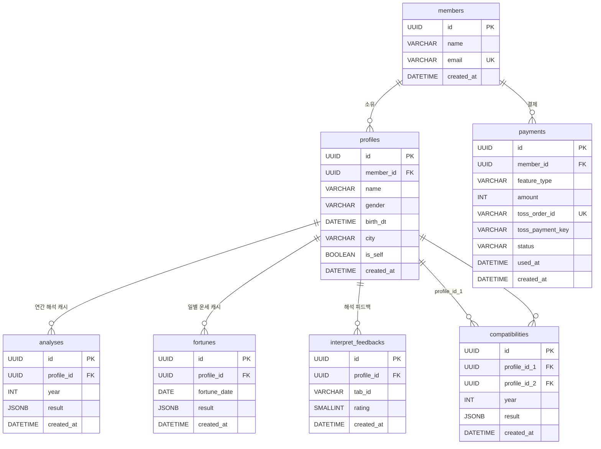

# BaZi (사주까치) 프로젝트 가이드

## 프로젝트 개요

사주팔자(四柱八字) 계산 및 오행 기반 종합 해석·시운·궁합·손금·풍수 웹 서비스.

- **백엔드**: Python 3.13 + FastAPI + sajupy + SQLAlchemy(asyncpg) + Alembic
- **프론트엔드**: Next.js 16 (App Router) + React 19 + TypeScript + Tailwind CSS 4
- **LLM**: Ollama 로컬 호출 (`OllamaAdapter`, 기본 모델 `qwen2.5:32b`) — 스트리밍 AI 풀이·챗·궁합 종합해석
- **MCP**: FastMCP 서버 `/mcp` 마운트 (도구 3종)
- **아키텍처**: Hexagonal Architecture (Port & Adapter), dependency-injector Singleton
- **패키지 관리**: uv (Python), npm (Node)

## 실행

```bash
# DB — /db 스킬 또는 scripts/db.sh (Colima 자동 기동 → 컨테이너 → healthy 대기 → alembic upgrade head → alembic check)
bash scripts/db.sh up
bash scripts/db.sh status | migrate "<메시지>" | reset --yes | down | logs [N] | sql "<query>"

# 백엔드 — 저장소 루트에서 실행 (src/kkachi/resource/local.toml 을 상대경로로 읽음)
uv run uvicorn kkachi.fastapi:app --reload --port 8000

# 프론트엔드 (npm run dev 는 .next 삭제 후 기동)
cd frontend && npm run dev

# 테스트
uv run pytest            # 55 tests
cd frontend && npx tsc --noEmit
```

### 설정·환경변수

| 위치 | 키 | 용도 |
|------|----|------|
| `src/kkachi/resource/local.toml` | `[db] url` | DB 접속 (`Container.config.db.url`) |
| `src/kkachi/resource/local.toml` | `[toss] secret_key` | Toss 결제 confirm |
| `src/kkachi/resource/local.toml` | `[korea_weather_api]`, `[ipapi_api]`, `[api-key] openai` | **미사용** (코드에서 참조 없음) |
| env | `KKACHI_CORS_ORIGINS` (기본 `http://localhost:3000`), `KKACHI_CORS_ORIGIN_REGEX` | CORS |
| env | `OLLAMA_BASE_URL` (기본 `http://localhost:11434`), `OLLAMA_MODEL` (기본 `qwen2.5:32b`) | LLM |
| `frontend/.env.local` | `NEXT_PUBLIC_API_URL` (기본 `http://localhost:8000`) | 프론트 → API |
| env | `KKACHI_DB_URL` | DB URL override — 앱(`fastapi.py`)·Alembic(`alembic/env.py`) 모두 env → local.toml → 기본값 순 |

- `src/kkachi/resource/hand_landmarker.task` (MediaPipe 손 랜드마크 모델, 7.8MB)는 **git 미추적** — 없으면 `/palmistry/analyze` 요청 시 실패. README의 curl 명령으로 다운로드.
- `frontend/next.config.ts`: `/api/*` → `127.0.0.1:8000` rewrite, tailscale 호스트 `allowedDevOrigins`.
- 이 머신은 `docker compose` 플러그인이 없고 `docker-compose` 바이너리만 있음 — `scripts/db.sh`가 둘을 자동 감지하므로 스크립트를 쓴다.

### DB 작업 규칙 (`/db` 스킬, `.claude/skills/db/SKILL.md`)
- 기동·마이그레이션·상태는 `bash scripts/db.sh <cmd>` 로만 한다. 손으로 `docker-compose up` + `alembic upgrade` 를 나눠 치지 않는다.
- 모델(`models.py`)을 바꾸면 `bash scripts/db.sh migrate "<메시지>"` → 생성된 리비전 파일 검토 → `up`. `up`·`status` 끝의 `alembic check` 가 모델↔DB 드리프트를 알려준다.
- `reset --yes` 는 로컬 데이터 전부 삭제 — 사용자가 명시적으로 요청했을 때만.
- 이미 적용된 리비전 파일은 수정하지 않는다 (downgrade 수정만 예외).

## 코드 구조

```
BaZi/
├── alembic/versions/            # 8개 마이그레이션 (아래 DB 스키마 참고). env.py 는 KKACHI_DB_URL → local.toml 순으로 URL 결정
├── docker/docker-compose.yml    # postgres:17 + pg_isready healthcheck, db/user/pw = bazi
├── scripts/db.sh                # DB up/status/migrate/reset/down/logs/sql — /db 스킬이 호출
├── .claude/skills/db/SKILL.md   # /db 스킬: 서브커맨드 선택·실패 해석·reset 확인 규칙
├── docs/
│   ├── REFACTORING.md           # 리팩토링 규칙 + hot spot 표
│   ├── ROADMAP.md               # 제품 핵심 루프 로드맵 — 우선순위·진행 현황 (기능 추가 전 필독)
│   ├── frontend/screen_spec.md  # 화면 명세
│   ├── frontend/*/scenarios.md  # 화면별 시나리오
│   ├── llm_samples/             # LLM 리포트 프롬프트·해석 출력 샘플
│   └── research/                # 리서치 문서
├── src/kkachi/
│   ├── fastapi.py               # 앱 + CORS + 라우터 8개 등록 + /mcp 마운트 + lifespan(local.toml 로드)
│   ├── container.py             # DI Container — Repo·Adapter·Service Singleton
│   ├── resource/                # local.toml, hand_landmarker.task
│   ├── domain/
│   │   ├── ganji.py             # Oheng, Stem, Branch, StemBranch, Pillar, Sipsin, SibiUnseong, Gongmang,
│   │   │                        #   StemCombine/StemClash, BranchCombine/Clash/Wonjin/Hyung/Hae/Pa, SAMHAP_GROUPS, OHENG_GUIDE
│   │   ├── natal.py             # Jeol, Samjae, Sinsal enum · Saju · NatalInfo · DaeunPeriod · PostnatalInfo
│   │   ├── interpretation.py    # InterpretBlock/Tip · FengShuiResult · ZodiacResult · NatalResult · PostnatalResult · Interpretation
│   │   ├── fortune.py           # Fortune (일진 결과) · FortuneCache
│   │   ├── compatibility.py     # PillarRelation · PillarSnapshot · CompatibilityResult · Compatibility
│   │   ├── user.py              # User, Gender("male"|"female")
│   │   ├── member.py / profile.py / payment.py
│   ├── application/
│   │   ├── kkachi_service.py         # NatalService(analyze/interpret_natal) · PostnatalService(analyze/interpret_postnatal)
│   │   │                             #   · KkachiService(analyze/interpret/build_chat_context)
│   │   ├── profile_service.py        # 프로필 CRUD(최대 10개) + analyze_profile() 연도별 캐시
│   │   ├── fortune_service.py        # get_fortune()/get_forecast() — fortunes 캐시 + 날씨 주입
│   │   ├── fortune_rules.py          # compute_fortune() 일진 점수 룰, 24절기, 손없는 날
│   │   ├── compatibility_service.py  # 궁합 점수·영역별 prose·관계유형(lover/friend/family)·LLM 프롬프트 (1085 LOC, hot spot)
│   │   ├── member_service.py         # 이메일 중복 시 기존 반환
│   │   ├── payment_service.py        # Toss prepare/confirm (deep_analysis 1900 · daily_fortune 990 · compatibility 1500)
│   │   ├── report_builder.py         # LlmReportBuilder — Interpretation → LLM 프롬프트용 마크다운
│   │   ├── port/                     # saju(Natal/Postnatal/Interpreter), member, profile, analysis, compatibility,
│   │   │                             #   fortune, weather, payment, feedback, llm
│   │   ├── interpreter/              # 13개: advice · daeun · fengshui · fortune · hand_shape · narrative · natal(함수 모음)
│   │   │                             #   · personality(Personality+ElementBalance) · relationship · samjae · seun · yongshin · zodiac
│   │   ├── use_case/                 # get_saju_context · get_annual_fortune · get_weather (MCP 도구용)
│   │   └── util/                     # util.py(year_to_ganji, branch_relation, josa…) · sipsin_meta · clash_combine_meta · zodiac_meta
│   └── adapter/
│       ├── inner/
│       │   ├── kkachi_controller.py        # prefix /kkachi — interpret · chat · stream-report
│       │   ├── member_controller.py        # /members
│       │   ├── profile_controller.py       # /members/{id}/profiles — CRUD·PATCH·analyze·daily·forecast·feedback
│       │   ├── compatibility_controller.py # /compatibility — ""·direct·chat·narrative
│       │   ├── payment_controller.py       # /payments — prepare·confirm
│       │   ├── palmistry_controller.py     # POST /palmistry/analyze (MediaPipe 랜드마크 + OpenCV 손금선 밀도)
│       │   ├── weather_controller.py       # GET /weather
│       │   ├── admin_controller.py         # GET /admin/feedback/summary
│       │   └── mcp_server.py               # FastMCP "사주까치" — get_saju_context · get_annual_fortune · get_weather_element
│       └── outer/
│           ├── natal_adapter.py            # NatalAdapter + cal_saju() (도시→경도 내부 룩업, sajupy 호출)
│           ├── postnatal_adapter.py        # PostnatalAdapter — 세운·대운·월운·충합·영역점수(reason 포함)·삼재
│           ├── weather_adapter.py          # Open-Meteo geocoding + forecast (past_days=14), WMO → 오행
│           ├── llm/ollama_adapter.py       # OllamaAdapter — get_advice · interpret · stream_chat · stream_interpret
│           └── db/
│               ├── models.py       # MemberModel · ProfileModel · AnalysisModel · FortuneModel · CompatibilityModel
│               │                   #   · InterpretFeedbackModel · PaymentModel
│               ├── member_repo.py  # MemberRepo
│               ├── profile_repo.py # ProfileRepo · AnalysisRepo · FortuneRepo · CompatibilityRepo · FeedbackRepo
│               └── payment_repo.py # PaymentRepo
├── frontend/src/
│   ├── app/
│   │   ├── page.tsx                 # 홈 — 날짜 헤더 · StoryTray · 프로필별 FortunePost(7일 예보) · VideoPost
│   │   ├── analysis/page.tsx        # 사주 분석 — 프로필 선택 / 직접 입력 → ResultSlides (로그인 불필요)
│   │   ├── analysis/deep/page.tsx   # /analysis 로 redirect 만 함 (구 심층 분석 경로 호환)
│   │   ├── chat/page.tsx            # 까치 상담 풀스크린 챗 (sessionStorage 입력값 → /kkachi/chat)
│   │   ├── compatibility/page.tsx   # 궁합 — PersonCard×2 · 관계 유형 · 스트리밍 종합해석 · ?p1=&p2= 딥링크
│   │   ├── compatibility/chat/page.tsx
│   │   ├── siun/page.tsx            # 시운(時運) — 프로필 전환, 오늘/내일/주간, 14일 전~31일 예보
│   │   ├── weather/page.tsx         # 날씨 오행 (GPS → ipapi → Seoul), 로그인 시 용신 팁
│   │   ├── palmistry/page.tsx       # 손금 (idle → preview → loading → result)
│   │   ├── join/ · my/ · profile/   # 가입/로그인 · 계정(로그아웃·탈퇴) · 프로필 관리
│   │   └── admin/feedback/page.tsx  # 탭별 👍/👎 요약 대시보드
│   ├── components/
│   │   ├── ResultSlides.tsx         # 결과 오케스트레이터 — StickySajuBar + 6개 feature 탭(?tab=) + FeedbackBar + SajuChat FAB
│   │   ├── AnalysisForm.tsx         # 이름·생년월일·시간(12지시)·성별 · 정밀 설정(분석연도) · 경도 자동(비노출)
│   │   ├── CompatibilityResult.tsx  # 궁합 결과 (621 LOC)
│   │   ├── PersonCard.tsx · ProfileCard.tsx · ProfileForm.tsx
│   │   ├── DailyFortune.tsx         # DetailView · WeeklyView · DailyFortunePanel
│   │   ├── SajuChat.tsx · CompatibilityChat.tsx   # /chat, /compatibility/chat 로 가는 FAB
│   │   ├── PillarDetail · PillarOhengGrid · ElementRadar · OhengAnalysis · OhaengRelationDiagram
│   │   ├── OhengPairDiagram · PillarPairDiagram   # 궁합 비교 다이어그램
│   │   ├── DaeunTimeline · DaeunSeunTable · DomainBarChart · ScoreBar
│   │   ├── SectionHeader · CollapsibleSectionHeader · InlineCollapsibleHeader · InterpretSection
│   │   ├── KkachiTip · TermBadge · Tooltip · FeedPost · BottomNav · LoadingSpinner
│   │   └── tabs/
│   │       ├── NatalTab.tsx         # 만세력 — natal/ 6개 섹션 조합
│   │       ├── natal/               # PillarSection · SipsinSection · JizanganSection · GongmangSection
│   │       │                        #   · SibiUnseongSection · SinsalSection · data.ts(SIPSIN_INFO, SINSAL_INFO 등 표시 메타)
│   │       ├── YongshinTab · SamjaeTab            # "용신·삼재" 탭
│   │       ├── DaeunTab · SeunTab · WolUnTab · FortuneTab   # "시운(時運)" 탭
│   │       └── ZodiacTab · FengShuiTab · AiTab
│   ├── lib/
│   │   ├── api.ts                # 모든 API 호출 + 스트리밍 reader
│   │   ├── ganji.ts              # 천간·지지 표시 메타 SoT (해석 분기 금지)
│   │   ├── elementColors.ts · zodiac.ts · glossary.ts · relations.ts · constants.ts · location.ts
│   └── types/analysis.ts
├── frontend/public/kkachi/       # normal/good/caution 까치, sinsal/ sipsin/ sipgan/ zodiac/ strength/ samjae/ sibi_unseong/
├── frontend/public/oheng/        # 오행 이미지 5종
└── tests/
    ├── adapter/       # test_analyzer · test_fortune · test_sibi_unseong
    └── application/   # test_interpret · test_compatibility
```

## 아키텍처 원칙

- **Hexagonal Architecture**: 도메인 로직은 외부 의존성과 분리. `domain/`에서 sajupy·sqlalchemy import 금지
- **Port & Adapter**: 추상 인터페이스(Port ABC) → 구현체(Adapter). Application이 Adapter를 직접 import 금지 (Container 경유)
- **DI**: dependency-injector Singleton, 컨트롤러에서 `@inject` + `Depends(Provide[Container.xxx])`
- **dataclass 직렬화**: schema 레이어 없이 `asdict()`로 직접 JSON 변환 (컨트롤러 요청 모델만 Pydantic)
- **컨트롤러는 thin**: 검증·HTTP 변환만. 예외: 챗/스트리밍 컨트롤러가 `svc._llm_port`에 직접 접근 중

## 데이터 흐름

```
POST /kkachi/interpret  (로그인 불필요)
  → KkachiService.analyze(user, year)
      → NatalAdapter.analyze     → NatalInfo   (간지, 오행, 강약, 용신, 십신, 십이운성, 신살, 지장간, 십이신살, 공망)
      → PostnatalAdapter.analyze → PostnatalInfo (세운, 대운, 월운 6개월, 충합, 영역점수+reason, 삼재)
  → KkachiService.interpret(natal, postnatal, user, name)
      → NatalService.interpret_natal       → NatalResult  (narratives, personality, element_balance, feng_shui, zodiac …)
      → PostnatalService.interpret_postnatal → PostnatalResult (yongshin, fortune_by_domain, annual/major/samjae_fortune, advice …)
      → Interpretation(natal, postnatal)
  → asdict() → JSON

POST /members/{id}/profiles/{pid}/analyze
  → ProfileService.analyze_profile → analyses(profile_id, year) 캐시 우선 → 없으면 위 파이프라인 후 저장

POST /kkachi/stream-report  (AI 풀이 탭)
  → analyze + interpret → LlmReportBuilder.build() 마크다운 → OllamaAdapter.stream_interpret → text/plain 스트림

POST /kkachi/chat  (까치 상담)
  → analyze + interpret → KkachiService.build_chat_context() → system prompt → OllamaAdapter.stream_chat

GET /members/{id}/profiles/{pid}/forecast?days=N&start_date=
  → FortuneService.get_forecast → 날짜별 fortunes 캐시 확인 → compute_fortune(natal, date, weather, postnatal) → upsert
```

- 시운(時運)·대운·세운·월운, 풍수(팔택풍수), 십이지신, 신살 해석 텍스트는 **모두 백엔드**에서 생성.
- 프론트 `lib/ganji.ts`·`tabs/natal/data.ts`는 표시용 메타(이름/색상/한 줄 태그라인)만 — 해석 분기 금지.

## Always / Never

**ALWAYS:**
- `uv run`으로 Python 실행 (pip, python 직접 실행 금지)
- 테스트를 먼저 실행해서 기존 동작 확인 후 수정
- 3개 이상 파일 변경 시 Plan 먼저
- **리팩토링 작업 시 `docs/REFACTORING.md`를 먼저 읽을 것**
- DB 기동·마이그레이션은 `/db` 스킬(`scripts/db.sh`)로 — 모델 변경 후 `alembic check` 드리프트 0 확인
- API·페이지·DB 스키마를 바꾸면 이 문서의 해당 섹션도 같은 커밋에서 갱신

**NEVER:**
- `git push --force`
- `rm -rf`
- `.env` 파일·`local.toml`의 실제 키 값 수정 또는 외부 전송

## Anti-bloat rules

**IMPORTANT: YOU MUST follow these rules:**
- 단일 사용 helper/util 함수 생성 금지 — 3번 이상 쓰일 때만 추출
- 래퍼, 팩토리, 불필요한 인디렉션 추가 금지
- 현재 태스크에 필요한 최소 복잡도만 사용
- 비슷한 코드 3줄 > 성급한 추상화
- 새 파일 생성보다 기존 파일 수정 우선

## 제품 방향 — "와, 진짜 내 얘기네?" 만들기

세 축 모두 **인프라는 깔림**. 다음 단계는 품질 튜닝.
**우선순위·진행 현황은 `docs/ROADMAP.md`가 정식 출처** (2026-09-12 핵심 루프 재정의: F0 측정 → R1 요약 카드 → R2 시간 모름 → R3 타이밍 리포트 → R4 알림 → R5 궁합 공유 → R6 연속성). 제품 기능을 추가하기 전에 ROADMAP §4·§5를 먼저 본다.

### ① 하이브리드 해석 엔진 (Rule + LLM) — 구현됨
- Rule 엔진(Interpreter 13개) → 구조화 데이터 → `LlmReportBuilder` 마크다운 → Ollama가 자연어로 변환
- 진입점: AI 풀이 탭(`/kkachi/stream-report`), 까치 상담(`/kkachi/chat`), 궁합 종합해석(`/compatibility/narrative`)·궁합 챗
- LLM은 해석 생성기가 아닌 **언어 변환기**. 한국어 강제·225자 제한·"사주에 따르면" 금지 규칙이 시스템 프롬프트에 있음
- 다음: 프롬프트 품질, 응답 지연(`num_predict` 500/700, `keep_alive` 10m) 튜닝

### ② 점수 근거 시각화 (Domain Scores) — 백엔드 구현됨
- `PostnatalAdapter._get_domain_scores` → `{score, level, reason}` (reason = 세운·대운 십신 근거 문장)
- 일진도 `compute_fortune` → `domain_scores[*].reason`
- 다음: 프론트 툴팁/아코디언 노출 보강

### ③ 피드백 루프 (Feedback Loop) — 구현됨
- `ResultSlides` 하단 FeedbackBar 👍/👎 → `POST .../feedback {tab_id, rating}` → `interpret_feedbacks`
- `/admin/feedback` 대시보드가 긍정률 낮은 탭 순으로 정렬
- 다음: 낮은 탭의 Interpreter부터 개선

## 코딩 컨벤션

- 인라인 import 금지 — 모든 import는 파일 최상단에 위치
- `__init__.py`는 비워두거나 re-export만
- 모듈 최상단 docstring 없음 (클래스 docstring만)
- 섹션 구분 주석 (`# ──`) 사용 금지
- 메서드명은 `_get_*` 패턴
- private `_` prefix는 모듈 내부용에만
- async 우선 (FastAPI 파이프라인 전체)
- 상수는 사용처 가까이 위치 (constant.py 분리 안 함)
- **클래스 메서드 순서**: public 메서드 상단, private(`_`) 메서드 하단
- UI 텍스트 레이블은 **한글(한자)** 병기 — 예) 용신(用神), 신강(身強)
- ruff: line-length 100, select E/F/I/UP (E501 무시). `.claude/hooks/lint.sh`가 Write/Edit 시 자동 실행

## API 스펙

`gender`는 항상 `"male" | "female"`. 응답은 dataclass `asdict()` 그대로.

```
# 사주 해석 (kkachi_controller, prefix /kkachi)
POST /kkachi/interpret       { birth_dt, gender, analysis_year=2026, city="Seoul", longitude?, name="" }
                             → { natal: NatalResult, postnatal: PostnatalResult }
POST /kkachi/stream-report   같은 요청 → text/plain 스트림 (LLM AI 풀이)
POST /kkachi/chat            { birth_dt, gender, analysis_year, city, name, messages:[{role,content}] } → text/plain 스트림

# 회원
POST   /members              { name, email } → 201 Member (이메일 중복 시 기존 반환)
GET    /members/{id}
DELETE /members/{id}         → 204 (프로필·분석·궁합·일진·피드백 cascade)

# 프로필 (prefix /members/{member_id}/profiles)
POST   ""                    { name, gender, birth_dt, city="Seoul", is_self=false } → 201 (10개 초과 시 400)
GET    ""                    → Profile[]
GET    /{pid}
PATCH  /{pid}                { name, gender, birth_dt, city }
DELETE /{pid}                → 204 (is_self 프로필은 409)
POST   /{pid}/analyze        { year=2026 } → Interpretation dict (analyses 캐시 우선)
GET    /{pid}/daily          → Fortune dict (오늘, fortunes 캐시 + 날씨 없으면 재계산)
GET    /{pid}/forecast       ?days=7&start_date=YYYY-MM-DD → Fortune[] (days 최대 35, 과거 날짜 가능)
POST   /{pid}/feedback       { tab_id, rating } → { success }

# 궁합 (prefix /compatibility) — relation_type: "lover" | "friend" | "family" (기본 lover)
POST /compatibility          { profile_id_1, profile_id_2, year, relation_type } → CompatibilityResult (캐시 우선, 404 if 없음)
POST /compatibility/direct   { person1:{name,gender,birth_dt,city}, person2, year, relation_type } → stateless
POST /compatibility/narrative 같은 요청 → text/plain 스트림 (LLM 종합해석)
POST /compatibility/chat     { person1, person2, year, messages, relation_type } → text/plain 스트림

# 기타
GET  /weather                ?city=Seoul&days=7&lat&lon → DailyWeather[] (days 최대 14, 응답에 과거 14일 포함)
POST /palmistry/analyze      multipart image → { hand_element, hand_type_korean, finger_ratio, aspect_ratio, line_scores{heart,head,life}, blocks[] }
POST /payments/prepare       { member_id, feature_type: deep_analysis|daily_fortune|compatibility } → { order_id, amount, feature_type, order_name }
POST /payments/confirm       { payment_key, order_id, amount } → Toss confirm → { success }   (프론트 결제 게이트는 제거됨)
GET  /admin/feedback/summary → [{ tab_id, total, positive, negative, positive_rate }] 긍정률 오름차순

# MCP (/mcp, streamable HTTP)
get_saju_context(birth_dt, gender, year, city, name) → str (~600자 요약)
get_annual_fortune(...)                                → dict (영역점수·세운·삼재·대운·충합)
get_weather_element(city)                              → dict (condition, element, temperature)
```

## DB 스키마


```mermaid
erDiagram
    members {
        UUID id PK
        VARCHAR name
        VARCHAR email UK
        DATETIME created_at
    }
    profiles {
        UUID id PK
        UUID member_id FK
        VARCHAR name
        VARCHAR gender
        DATETIME birth_dt
        VARCHAR city
        BOOLEAN is_self
        DATETIME created_at
    }
    analyses {
        UUID id PK
        UUID profile_id FK
        INT year
        JSONB result
        DATETIME created_at
    }
    fortunes {
        UUID id PK
        UUID profile_id FK
        DATE fortune_date
        JSONB result
        DATETIME created_at
    }
    compatibilities {
        UUID id PK
        UUID profile_id_1 FK
        UUID profile_id_2 FK
        INT year
        JSONB result
        DATETIME created_at
    }
    interpret_feedbacks {
        UUID id PK
        UUID profile_id FK
        VARCHAR tab_id
        SMALLINT rating
        DATETIME created_at
    }
    payments {
        UUID id PK
        UUID member_id FK
        VARCHAR feature_type
        INT amount
        VARCHAR toss_order_id UK
        VARCHAR toss_payment_key
        VARCHAR status
        DATETIME used_at
        DATETIME created_at
    }

    members ||--o{ profiles : "소유"
    members ||--o{ payments : "결제"
    profiles ||--o{ analyses : "연간 해석 캐시"
    profiles ||--o{ fortunes : "일별 운세 캐시"
    profiles ||--o{ interpret_feedbacks : "해석 피드백"
    profiles ||--o{ compatibilities : "profile_id_1"
    profiles ||--o{ compatibilities : "profile_id_2"
```

> `fortunes`는 `daily_fortunes`에서 rename됨 (`150d31f50d94`). `is_self`, `interpret_feedbacks`, `payments`는 이후 마이그레이션 추가.

### 유니크 제약
| 테이블 | 유니크 키 | 목적 |
|--------|----------|------|
| `members` | `email` | 이메일 중복 방지 (비밀번호 없음, 이메일이 식별자) |
| `analyses` | `(profile_id, year)` | 연도별 해석 캐시 |
| `fortunes` | `(profile_id, fortune_date)` | 날짜별 일진 캐시 (upsert) |
| `compatibilities` | `(profile_id_1, profile_id_2, year)` | 궁합 캐시, pid1 < pid2 정규화 |
| `payments` | `toss_order_id` | 주문 중복 방지 |

### 캐시 전략
- `analyses`, `fortunes`, `compatibilities`는 캐시 테이블 — 동일 입력이면 재계산 없이 반환
- `compatibilities.profile_id_1/2`는 항상 `min(id) / max(id)` 순 저장 (A↔B 순서 무관)
- `fortunes`는 날씨 포함 여부 확인 후 upsert (날씨 없이 캐시된 경우 날씨 붙여 재계산)
- 프로필·회원 삭제 시 캐시는 FK cascade로 함께 삭제

## 서비스명 — 사주까치

까치는 한국 전통에서 길조(吉鳥). 아침에 울면 반가운 소식이 온다는 상징.
- **길조** → 매일 오늘의 기운을 가장 먼저 전해주는 존재
- **오작교(烏鵲橋)** → 견우직녀 인연을 이어준 다리 → 궁합 기능 콘셉트
- 태그라인: "까치가 울면 반가운 소식이 온다 — 사주까치가 오늘의 기운을 가장 먼저 전해드립니다"

## 프론트엔드 페이지

| 경로 | 설명 | 로그인 |
|------|------|--------|
| `/` | 비로그인: 날짜 헤더 + 소개 영상 / 로그인: StoryTray + 프로필별 오늘 운세 FortunePost(7일 예보, 손없는 날 배지) + 영상 | 선택 |
| `/join` | 이름+이메일 → `POST /members` → 프로필 있으면 `/`, 없으면 Step 2(내 사주 등록, `is_self=true`) → `/` | — |
| `/my` | 계정 정보 · 로그아웃 · **회원 탈퇴**(이메일 재입력 확인 후 cascade 삭제) | 필수 (`/join` redirect) |
| `/profile` | 프로필 추가/수정/삭제 (최대 10개, `is_self`는 삭제 불가·"나" 뱃지) | 필수 |
| `/analysis` | 사주 분석 — "저장된 프로필 불러오기" / "프로필 직접 입력하기" 탭 → `ResultSlides` | 선택 (직접 입력은 비로그인 가능) |
| `/analysis/deep` | `/analysis`로 redirect (구 경로 호환용 껍데기) | — |
| `/chat` | 까치 상담 풀스크린 챗 — sessionStorage 입력값 없으면 안내만 | — |
| `/compatibility` | 궁합 — PersonCard×2(프로필/직접), 관계 유형 3종, 연도 → 결과 + 스트리밍 종합해석 + 챗 FAB. `?p1=&p2=` 딥링크 | 선택 |
| `/compatibility/chat` | 궁합 상담 챗 (sessionStorage `kkachi_compat_*`) | — |
| `/siun` | 시운(時運) — is_self 프로필 기본, 프로필 전환, 오늘/내일/주간 탭, 날씨 배지 | 필수(비로그인 CTA) |
| `/weather` | 날씨 오행 — GPS → ipapi → Seoul, 도시 검색, 시간별 예보, 로그인 시 용신 팁 | 선택 |
| `/palmistry` | 손금 — 업로드 → 미리보기 → 분석 → 오행형·손금선 점수·해석 블록 | — |
| `/admin/feedback` | 탭별 👍/👎 긍정률 대시보드 (인증 없음) | — |

- **BottomNav 5탭**: 홈 · 분석 · 궁합 · 시운 · 계정(비로그인 시 로그인). `/chat`, `/compatibility/chat`에서는 숨김.
- `/weather`, `/palmistry`, `/admin/feedback`은 네비게이션에 연결되어 있지 않음 — URL 직접 진입만 가능.
- 로그인 상태는 `localStorage["kkachi_member_id"]` (`MEMBER_ID_KEY`)로 판단. 비밀번호 없음.
- 페이지 진입 시 `ipapi.co`로 IP 위치 감지 → city(+ longitude) 자동 입력. `longitude`는 UI 비노출로 `User.longitude` → sajupy 직접 전달.

### 분석 입력 흐름 (`/analysis`)
- **직접 입력**: `AnalysisForm` — 이름·생년월일·태어난 시간(12지시, 모름=12:00)·성별, "정밀 설정" 접이식에 분석연도. **"프로필 저장" 버튼을 먼저 눌러야 "분석 시작" 활성화** (로그인 시 실제 `POST /profiles`, 비로그인 시 확인 단계 역할). → `POST /kkachi/interpret`
- **프로필 선택**: 드롭다운 + 분석연도 → `POST /members/{id}/profiles/{pid}/analyze` (캐시)
- 성공 시 `sessionStorage`에 저장 → 재진입 시 자동 재분석, `/chat`·AI 풀이 탭이 재사용

### sessionStorage 키
| 키 | 저장 | 사용 |
|----|------|------|
| `kkachi_analysis_input` | `/analysis` | `/analysis` 재진입, `/chat`, `AiTab` |
| `kkachi_analysis_name` | `/analysis` | 위와 동일 (KkachiTip `{name}님` 개인화) |
| `kkachi_profile_input` | `/analysis` 프로필 모드 | `{memberId, profileId, year}` → FeedbackBar가 profileId 필요 |
| `kkachi_compat_input` / `kkachi_compat_names` | `/compatibility` | `/compatibility/chat` |

### ResultSlides 탭 구성 (`?tab=`)
| id | 라벨 | 컴포넌트 |
|----|------|---------|
| `natal` | 만세력 | `NatalTab` → PillarSection · SipsinSection · JizanganSection · GongmangSection · SibiUnseongSection · SinsalSection |
| `yongshin` | 용신·삼재 | `YongshinTab`(신강·신약, 용신·기신) + `SamjaeTab` |
| `daeun` | 시운(時運) | `DaeunTab` + `SeunTab` + `WolUnTab` + `FortuneTab`(충합, 영역별 운) |
| `zodiac` | 십이지신 | `ZodiacTab` |
| `fengshui` | 풍수 | `FengShuiTab` |
| `ai` | AI 풀이 | `AiTab` → `/kkachi/stream-report` 스트리밍 (Ollama 없으면 에러 문구) |

- 모든 탭 하단에 `FeedbackBar` (memberId·profileId 있을 때만 전송), 우하단 `SajuChat` FAB → `/chat`.
- 카드 포맷: `slide-card` + `CollapsibleSectionHeader`/`SectionHeader` + divider + 본문 시작에 인트로 `KkachiTip` 필수 (`docs/REFACTORING.md §4-3`).

## 오늘의 운세(일진) 설계 — `fortune_rules.compute_fortune`

### 점수 계산 (base 50 + 보정, 0~100 clamp)
| 조건 | 점수 |
|------|------|
| 오늘 일간 오행 = 용신 | +25 |
| 오늘 일간이 용신을 生 | +15 |
| 오늘 일간이 용신을 剋 (또는 용신이 일간을 剋) | -15 |
| 오늘 일지와 내 일지 육합 | +15 |
| 오늘 일지와 내 일지 충 | -15 |
| 오늘 오행이 내 주 오행을 生 | +10 |
| 길신 십신 (食神/正財/正官/正印) | +8 |
| 흉신 십신 (偏官/劫財) | -8 |
| 날씨 오행 = 용신 | +10 |
| 날씨 오행이 용신을 生 | +5 |
| 날씨 오행이 용신을 剋 | -8 |

- 결과 `Fortune`: total_score, level(좋은 날/평범한 날/주의가 필요한 날), domain_scores{score,level,reason}, description, tips(최대 3), weather, solar_term(24절기 — 해당일이면 팁 맨 앞에 삽입), yongshin, son_eomneun_nal(음력 끝자리 9·0), 시운 그리드(daeun/seun/wol ganji + yongshin_in_*)
- 홈·시운 화면의 까치 이미지는 `FORECAST_LEVEL_META[level]`로 선택

### 날씨 연동 (Open-Meteo, API 키 불필요)
- 도시명 → Geocoding API → lat/lon (프로세스 내 캐시, 실패 시 Seoul) 또는 `lat/lon` 직접 전달
- `past_days=14` + `forecast_days≤16` 한 번에 fetch → 날짜별 맵으로 각 일진에 주입 (시운의 과거 날짜용)
- WMO 코드 → 오행: 맑음(0·1)=火, 구름많음(2)=土, 흐림(3)=金, 안개(45·48)=土, 비·눈·소나기·뇌우=水. **木 매핑은 없음**
- 시간별은 0·3·6·9·12·15·18·21시만 추출

## 만세력(NatalTab) 설계 원칙

`tabs/natal/` 섹션 6개. 각 섹션은 데이터가 있을 때만 렌더.

1. **사주팔자(四柱八字)** `PillarSection` — 팔자 그리드 + 오행 분포 + `pillar_summary`(백엔드 1문장)
2. **십신(十神)** `SipsinSection` — 일간 기준 배너 + 카드(`SIPSIN_INFO`, 이미지 `sipsin/sipsin_{한글}.png`)
3. **지장간(地藏干)** `JizanganSection` — 기둥별 지장간·비중·역할(여기/중기/정기)
4. **공망(空亡)** `GongmangSection` — 공망 기둥만 표시
5. **십이운성(十二運星)** `SibiUnseongSection` — 4단계(`UNSEONG_PHASE`) 항상 표시, 해당 없는 것은 흐리게, 이미지 `sibi_unseong/*.png`
6. **신살(神殺)** `SinsalSection` — 십이신살 + 보유 신살 카드(`SINSAL_INFO` 9종: 도화·역마·화개·천을귀인·문창귀인·장성·백호·천덕귀인·월덕귀인), 콤보 `SINSAL_COMBOS`, 이미지 `sinsal/sinsal_{한글}.png` (없으면 `normal_kkachi_00.png` 폴백)

- 백엔드 `_get_sibi_unseong()` 반환 라벨: "년주/월주/일주/시주"
- 이름 개인화: `sessionStorage["kkachi_analysis_name"]` → `/analysis` → `ResultSlides name` → 각 탭 prop → KkachiTip `{name}님은~`

## 테스트

```
tests/
├── adapter/
│   ├── test_analyzer.py        # 선천 분석 (강약, 용신, 십신)
│   ├── test_fortune.py         # 세운·대운·충합
│   └── test_sibi_unseong.py    # 십이운성·신살
└── application/
    ├── test_interpret.py       # 종합 해석 통합 테스트
    └── test_compatibility.py   # 궁합 점수·관계·삼합·캐시·관계유형
```

> 미커버 영역: `fortune_rules.compute_fortune`(일진 점수), 풍수·십이지신 Interpreter, 컨트롤러 레벨 테스트. 신규 작성 시 우선.

## 알려진 이슈 / 정리 후보 (2026-09-12 기준)

- `local.toml`의 `[korea_weather_api]`, `[ipapi_api]`, `[api-key] openai` 섹션은 코드에서 참조 없음 (실제 키가 들어 있어 삭제는 사용자 결정)
- `hand_landmarker.task`는 `.gitignore` 처리 (7.8MB) — 새 환경·배포 시 README의 다운로드 단계 필요
